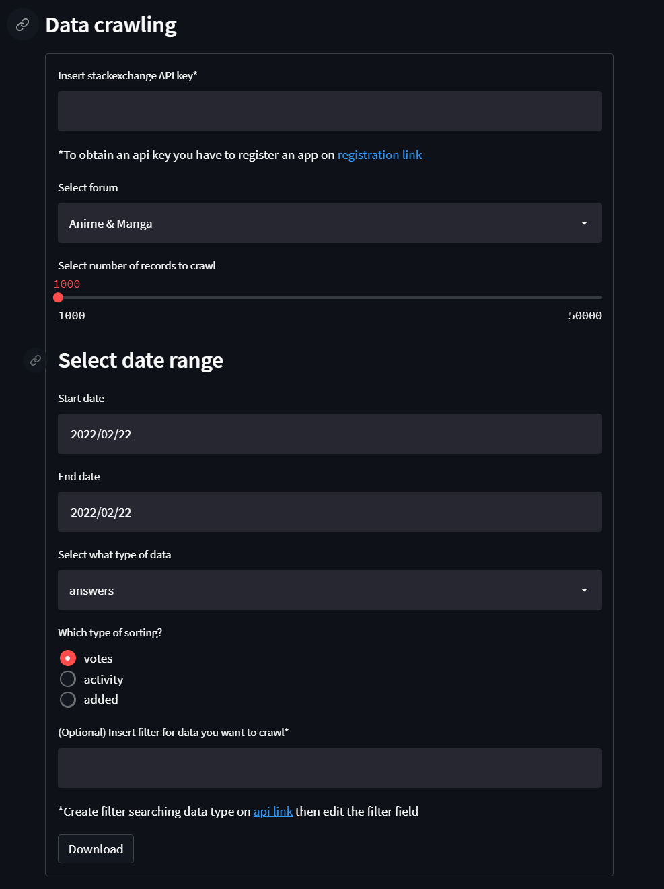

# Dashboard - Data crawling from stackexchange forum
### Getting Started

### Install packages
```
pip install streamlit==1.5.1
pip install stackapi==0.2.0
```
### Run
```
streamlit run dashboard.py
```

### Overview Dashboard
<p align=center>
    
</p>


### Clone the repo
Get a copy of this repo using git clone
```
git clone https://github.com/MatteoBiviano/stackexchange-crawler-webapp.git
```


